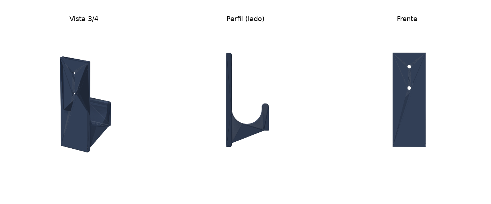

# Soporte de pared para katana

Son 2 piezas iguales. La katana queda acostada sobre las dos cunas.

## Archivos

| Archivo | Para qué |
|---|---|
| `soporte_katana.stl` | Una pieza, ya acostada para imprimir |
| `soporte_katana_par.stl` | Las dos piezas juntas en una sola impresión |
| `soporte_katana_vista.stl` | La pieza en la posición en que va en la pared (solo para verla) |
| `generar_soporte.py` | Genera los STL; cambia las medidas al inicio del archivo |

## Medidas (mm)

- Pieza: 40 de ancho × 115 de alto × 52 de salida desde la pared.
- Cuna: 38 de hueco interior, con fondo redondo, para la saya (~30 mm) más fieltro.
- Tornillos: 2 agujeros de Ø4.5 con avellanado de Ø9 (tornillo #8 o de 4 mm, cabeza plana).

Si tu saya mide más de 32 mm de ancho, sube `HUECO` en `generar_soporte.py`
(saya + 6 mm) y vuelve a generar con `python3 generar_soporte.py .`
(necesita `pip install trimesh manifold3d shapely mapbox_earcut`).

## Impresión

- **Material:** PETG (mejor) o PLA.
- **Orientación:** como viene el STL, acostado de lado. Así no lleva soportes y las capas siguen la curva del gancho, que es lo más resistente.
- **Capa:** 0.2 mm · **Paredes:** 4 · **Relleno:** 30 % gyroid · **Soportes:** no.
- **Material por pieza:** unos 40–50 g.

## Instalación

1. Pega fieltro adhesivo dentro de cada cuna para no rayar la saya.
2. Separa las piezas unos 50 cm, cada una a unos 20 cm de un extremo de la katana.
3. Atornilla a un montante si lo hay. Si es tablaroca, usa taquetes para tablaroca de #8.
4. Sobre la puerta de entrada: arriba del marco quedan unos 36 cm hasta el techo, así que pon la base de las piezas a unos 212 cm del piso.
5. Revisa que las dos cunas queden a la misma altura con un nivel antes de apretar.
